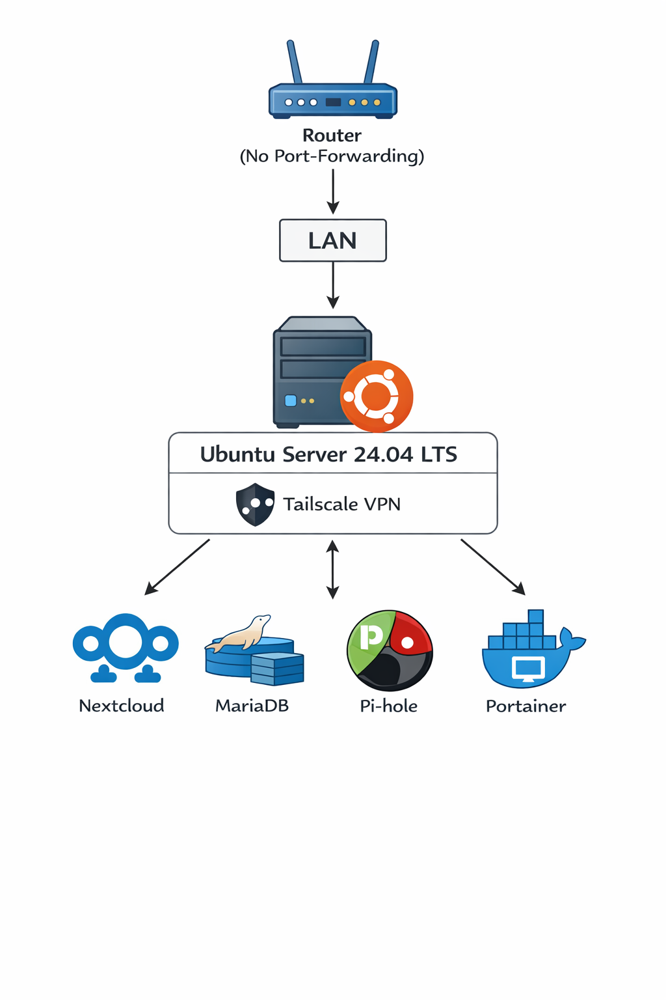

# Homelab Ubuntu – Self-Hosting Infrastruktur

<div align="center">
  
</div>

## Übersicht

Dieses Repository dokumentiert den Aufbau eines Self-Hosting-Homelabs auf Ubuntu.

Ziel ist es, häufig genutzte Infrastruktur-Dienste stabil, reproduzierbar und wartbar zu betreiben. Alle Services laufen containerisiert mit Docker und sind so konfiguriert, dass sie lokal gehostet und bei Bedarf schnell neu bereitgestellt werden können.

Die Anleitung zeigt Schritt für Schritt, wie die Umgebung auf einem frischen System aufgebaut und betrieben werden kann.

## Server & Specs

| Komponente       | Details |
|-----------------|---------|
| CPU / RAM       | Intel i5 10400 / 32GB RAM |
| Storage         | 1x 2TB SSD |
| OS              | Ubuntu Server 24.04 LTS |
| Netzwerk        | LAN + Tailscale VPN (kein Portforwarding) |
| Container-Host  | Docker & Docker Compose |
| Monitoring      | Netdata (Dashboard & Alerts) |
| Zugriff         | Admin nur LAN/VPN, SSH Passwort (Key optional später) |

## Container-Stacks

| Dienst       | Zweck                       | Zugang            | Daten-Volume          |
|-------------|-----------------------------|-----------------|--------------------|
| Nextcloud    | Files & Collaboration       | LAN/VPN, 8080   | `nextcloud_data`   |
| MariaDB      | Datenbank für Nextcloud     | Intern          | `db_data`          |
| Pi-hole      | DNS-Filtering & Ads Block   | LAN/VPN, 53/8090| `pihole_data`      |
| Portainer    | Container Management        | LAN/VPN, 9443   | `portainer_data`   |

> Alle Container laufen in isolierten Docker-Netzwerken.

## Monitoring (Netdata)

- Echtzeit-Überwachung von CPU, RAM, Disk, Netzwerk  
- Alerts bei kritischen Schwellenwerten  
- Dashboard für schnelle Übersicht & Trendanalyse  

## Praktische Befehle

```bash
# Container Status prüfen
docker compose ps

# Logs einzelner Container in Echtzeit
docker logs -f nextcloud
docker logs -f pihole

# Health-Status aller Container
docker inspect -f '{{.Name}}: {{.State.Health.Status}}' $(docker ps -q)

# Container neu starten
docker compose restart

# Updates ziehen und deployen
docker compose pull
docker compose up -d
```

# Ubuntu Homelab Server Setup Guide


**Homelab Setup auf Ubuntu 24.04 LTS**

Dieses Repository zeigt, wie man einen Heimserver mit Docker betreibt und folgende Services installiert:

* Pi-hole (DNS / Adblocking)
* Nextcloud (Private Cloud)
* Portainer (Docker Management)
* Netdata (Server Monitoring)

Alle sensiblen Daten sind durch **Platzhalter ersetzt**.

> **💡 Tipp:** Sicheres Passwort mit OpenSSL generieren:
>
> ```bash
> openssl rand -base64 32
> ```
>
> - Erstellt ein **32-Byte Passwort** (~43 Zeichen) mit Groß-/Kleinbuchstaben, Zahlen und Sonderzeichen.
> - Direkt kopierbar in deinen Passwort-Manager oder deine Konfiguration.
> - Einfach, schnell und kryptographisch sicher.


# Inhaltsverzeichnis

* Quick Start
* System vorbereiten
* Firewall konfigurieren
* Docker installieren
* Portainer installieren
* Pi-hole installieren
* Nextcloud installieren
* Monitoring installieren
* Backup Beispiel
* Zugriff auf Services
* Platzhalter


# Quick Start

Repository klonen:

```bash
git clone https://github.com/rixs94/homelab-ubuntu.git
cd homelab-ubuntu
```

---

# System vorbereiten

```bash
# System aktualisieren
sudo apt update && sudo apt upgrade -y

# Benutzer erstellen
sudo adduser <USERNAME>

# Benutzer zur sudo Gruppe hinzufügen
sudo usermod -aG sudo <USERNAME>
```


# Firewall (UFW)

```bash
# Firewall installieren
sudo apt install ufw -y

# Standardregeln
sudo ufw default deny incoming
sudo ufw default allow outgoing

# Wichtige Ports freigeben
sudo ufw allow 22/tcp
sudo ufw allow 53
sudo ufw allow 80
sudo ufw allow 443
sudo ufw allow 8080
sudo ufw allow 9443
sudo ufw allow 19999

# Firewall aktivieren
sudo ufw enable

# Status prüfen
sudo ufw status
```


# Docker installieren

```bash
# Voraussetzungen installieren
sudo apt install ca-certificates curl gnupg lsb-release -y

# Docker GPG Key hinzufügen
sudo mkdir -p /etc/apt/keyrings

curl -fsSL https://download.docker.com/linux/ubuntu/gpg \
| sudo gpg --dearmor \
-o /etc/apt/keyrings/docker.gpg

# Docker Repository hinzufügen
echo \
"deb [arch=$(dpkg --print-architecture) \
signed-by=/etc/apt/keyrings/docker.gpg] \
https://download.docker.com/linux/ubuntu \
$(lsb_release -cs) stable" \
| sudo tee /etc/apt/sources.list.d/docker.list

# Docker installieren
sudo apt update
sudo apt install docker-ce docker-ce-cli containerd.io docker-buildx-plugin docker-compose-plugin -y

# Benutzer zur Docker Gruppe hinzufügen
sudo usermod -aG docker <USERNAME>

# Docker testen
docker run hello-world
```


# Portainer installieren

```bash
# Docker Volume erstellen
docker volume create portainer_data

# Portainer Container starten
docker run -d \
--name portainer \
-p 9443:9443 \
-p 8000:8000 \
--restart=unless-stopped \
-v /var/run/docker.sock:/var/run/docker.sock \
-v portainer_data:/data \
portainer/portainer-ce:latest
```

Zugriff:

```
https://<SERVER-IP>:9443
```


# Pi-hole installieren

```bash
# Ordner erstellen
mkdir -p ~/docker/pihole

# Ordner wechseln
cd ~/docker/pihole

# Compose Datei erstellen
nano docker-compose.yml
```

```yaml
services:
  pihole:
    container_name: pihole
    image: pihole/pihole:latest
    network_mode: "host"
    environment:
      TZ: 'Europe/Berlin'
      WEBPASSWORD: '<PIHOLE_PASSWORD>'
      DNSMASQ_LISTENING: all
    volumes:
      - './etc-pihole:/etc/pihole'
      - './etc-dnsmasq.d:/etc/dnsmasq.d'
    restart: unless-stopped
```

```bash
# Container starten
docker compose up -d
```

Zugriff:

```
http://<SERVER-IP>/admin
```


# Nextcloud installieren

```bash
# Ordner erstellen
mkdir -p ~/docker/nextcloud

# Ordner wechseln
cd ~/docker/nextcloud

# Compose Datei erstellen
nano docker-compose.yml
```

```yaml
services:

  db:
    image: mariadb:11
    restart: unless-stopped
    volumes:
      - db_data:/var/lib/mysql
    environment:
      MYSQL_ROOT_PASSWORD: '<MYSQL_ROOT_PASSWORD>'
      MYSQL_DATABASE: nextcloud
      MYSQL_USER: nextcloud
      MYSQL_PASSWORD: '<MYSQL_PASSWORD>'

  nextcloud:
    image: nextcloud:stable
    restart: unless-stopped
    depends_on:
      - db
    ports:
      - "0.0.0.0:8080:80"
    volumes:
      - nextcloud_data:/var/www/html
    environment:
      MYSQL_HOST: db
      MYSQL_DATABASE: nextcloud
      MYSQL_USER: nextcloud
      MYSQL_PASSWORD: '<MYSQL_PASSWORD>'

volumes:
  db_data:
  nextcloud_data:
```

```bash
# Container starten
docker compose up -d
```

Zugriff:

```
http://<SERVER-IP>:8080
```


# Monitoring (Netdata)

```bash
# Netdata installieren
bash <(curl -Ss https://my-netdata.io/kickstart.sh)
```

Dashboard:

```
http://<SERVER-IP>:19999
```


# Backup Beispiel

```bash
# Nextcloud Daten sichern
docker run --rm \
-v nextcloud_nextcloud_data:/data \
-v ~/backup:/backup \
alpine \
sh -c "cd /data && tar czf /backup/nextcloud_backup_$(date +%F).tar.gz ."
```

```bash
# Pi-hole Backup
tar czf ~/backup/pihole_backup_$(date +%F).tar.gz \
~/docker/pihole/etc-pihole \
~/docker/pihole/etc-dnsmasq.d
```


# Zugriff auf Services

| Service   | URL                      |
| --------- | ------------------------ |
| Portainer | https://<SERVER-IP>:9443 |
| Pi-hole   | http://<SERVER-IP>/admin |
| Nextcloud | http://<SERVER-IP>:8080  |
| Netdata   | http://<SERVER-IP>:19999 |


# Platzhalter ersetzen

Folgende Werte musst du anpassen:

```
<USERNAME>
<SERVER-IP>
<PIHOLE_PASSWORD>
<MYSQL_ROOT_PASSWORD>
<MYSQL_PASSWORD>
```


# Lizenz

MIT License
